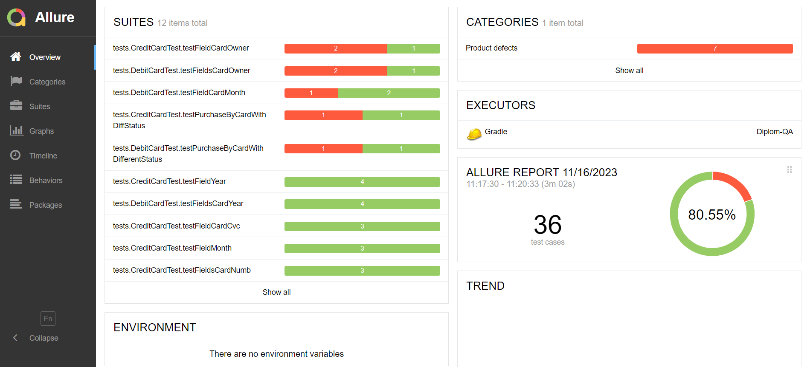

# Отчет по итогам тестирования

## 1 Краткое описание:
В рамках данного проекта стояла задача - автоматизировать тестирование комплексного сервиса покупки тура, взаимодействующего с СУБД и API Банка.

## 2 Общее количество тест-кейсов:
1. 36 тестов
2. успешных 29
3. неуспешных 7
4. общее соотношение: 80.55% / 18.45%

По результатам авто-тестов сооставлены баг-репорты, которые описаны в issues: https://github.com/Vladimir444k/Diplom-QA.git

## 3 Общие рекомедации:
Сервис не готов к релизу, потому что найденные баги критичны и негативно скажутся на бизнесе